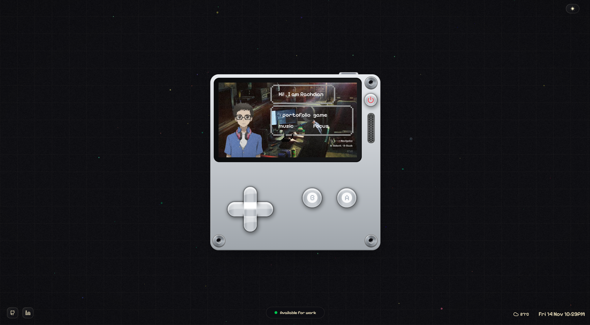
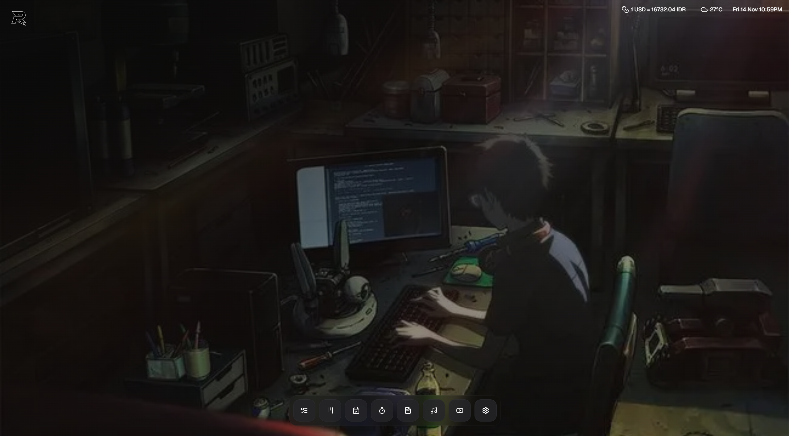

# Rchdev Portfolio



A modern, interactive **[Rachdian portfolio](https://rachdian.vercel.app)** built with **Next.js 15**, **Prisma**, and **shadcn/ui**

# Rchdev Focus



## About
Focus is a comprehensive productivity suite designed to help you stay focused, organized, and efficient. It combines multiple productivity tools in one elegant interface.

## ✨ Features

- **Pomodoro Timer**: Boost your productivity with customizable work/break intervals
- **Ambient Sounds**: Enhance focus with a variety of ambient sounds from nature, urban environments, and more
- **Todo App**: Keep track of your tasks in a simple, intuitive interface
- **Habit Tracker**: Build and maintain positive habits with visual tracking
- **Notepad**: Jot down quick notes and thoughts
- **Kanban Board**: Organize your workflow visually
- **YouTube Player**: Watch educational content without distractions
- **Weather Forecast**: Check current weather conditions and forecasts
- **Currency Exchange**: Convert between different currencies with up-to-date exchange rates

## 🌟 Usage

Focus is designed to be intuitive and easy to use:

1. **Start a Pomodoro Session**: Set your timer and get to work
2. **Play Ambient Sounds**: Choose from various categories of sounds to create your perfect focus environment
3. **Manage Tasks**: Add, update, and track your tasks with the Todo App
4. **Take Notes**: Use the Notepad to capture your ideas
5. **Track Habits**: Build consistency with the Habit Tracker
6. **Organize Projects**: Use the Kanban board to visualize your workflow
7. **Watch Educational Content**: Use the distraction-free YouTube player
8. **Check Weather**: View current weather conditions and forecasts
9. **Convert Currencies**: Use the Currency Exchange to convert between different currencies

> This portfolio showcases my work, my projects, and my personality

---

## Tech Stack

**Framework & Runtime**
- [Next.js 15](https://nextjs.org/) — UI Framework
- [TypeScript 5](https://www.typescriptlang.org/) — For type safety
- [React](https://reactjs.org/)

**Styling & UI**
- [Tailwind CSS 4](https://tailwindcss.com/) — For Styling
- [shadcn/ui](https://ui.shadcn.com/) — for accessible components
- [Lucide Icons](https://lucide.dev/) — for Icon
- [Framer Motion (motion)](https://motion.dev/) — for animation

**State & Utilities**
- [Zustand](https://github.com/pmndrs/zustand)
- [TanStack Query](https://tanstack.com/query)
- [Day.js](https://day.js.org/)
- [Lodash](https://lodash.com/)

---
## 🔧 Getting Started

### Prerequisites

- Node.js (version 18 or higher)
- pnpm
- OpenWeather API key (for weather functionality)

## Run Project Locally

### Clone the repository
```bash
git clone https://github.com/RachdianZulkarnain/rchdev-portofolio.git
cd portfolio
````

### Install dependencies 

```bash
npm install
```

### Set up environment variables

Create a `.env` & copy the variables from `.env.example` file in the root and configure it.

### Generate Prisma Client

```bash
npx prisma generate
```

### Run the development server

```bash
npm run dev
```

> Your portfolio should now be live at **[http://localhost:3000]** 🎉

---

## Deployment

Deployed easily via [Vercel](https://vercel.com/) (recommended).

1. Connect your GitHub repository.
2. Add your environment variables in the Vercel dashboard.
3. Deploy → done!


